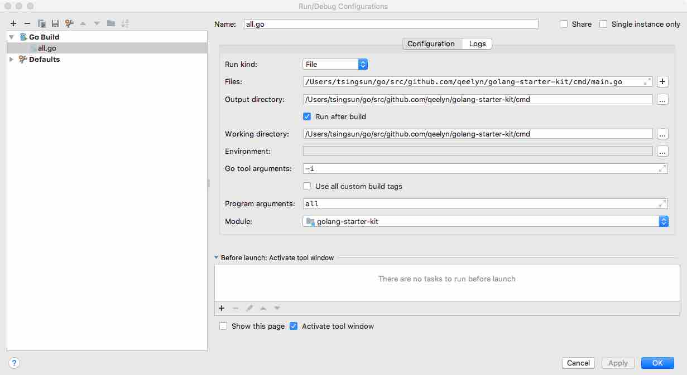

### 翻墙

目前套件使用翻墙的主要原因为依赖golang.org的包.而golang.org是被墙的.

* 在配合DEP指定忽略被墙的包(需要手动放入GOPATH中)可不使用翻墙,
但发现在使用GOPATH的包时编译速度下降,建议有条件翻墙就上.

* 使用带有http proxy,如shadowsocks(mac),因为如果使用全局模式时,在socks模式下会被站点墙
   
   1. 设置好terminal: 
    ``` 
    // linux
    export http_proxy=http://127.0.0.1:1087
    export https_proxy=http://127.0.0.1:1087
    
    // window(在win10、shadowsocks PAC模式下测试过,goland中配置proxy无效)
    set http_proxy=http://localhost:1080
    set https_proxy=http://localhost:1080
    ```
### DEP

```
go get -u github.com/golang/dep/cmd/dep

dep ensure 同步包
```


第一次初始化时,可用以下命令
```
    dep init -gopath -v -no-examples                
```    

### Build

本套件默认的编译路径为cmd,所有的配置也是针对该路径的.请在开发时调整一下IDE配置
* goland
